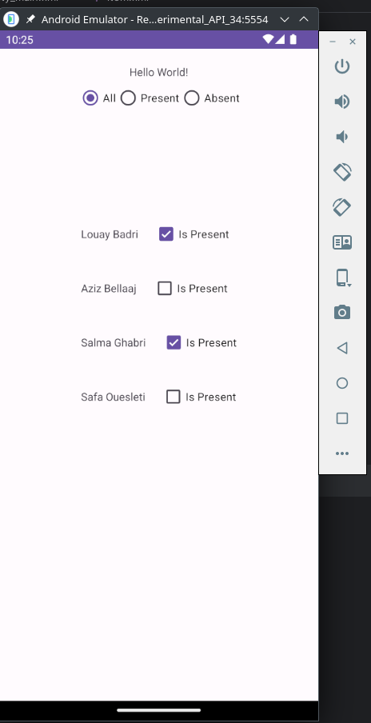
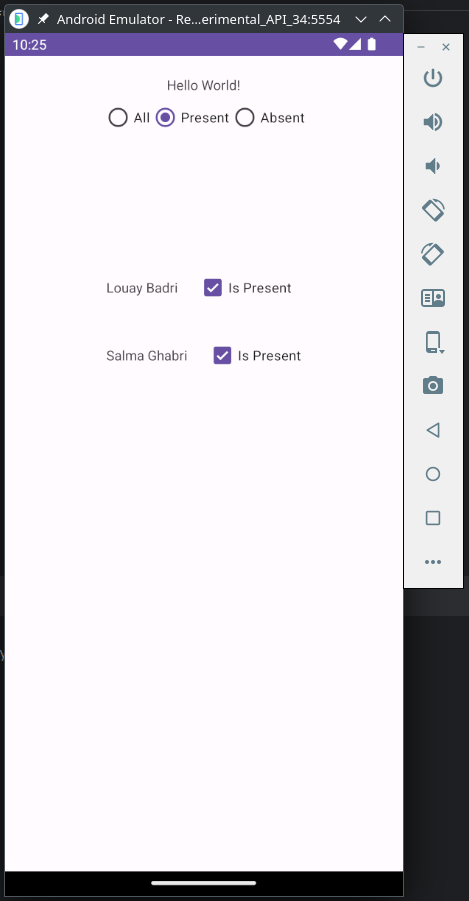
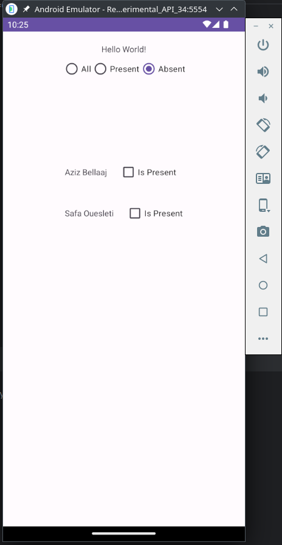
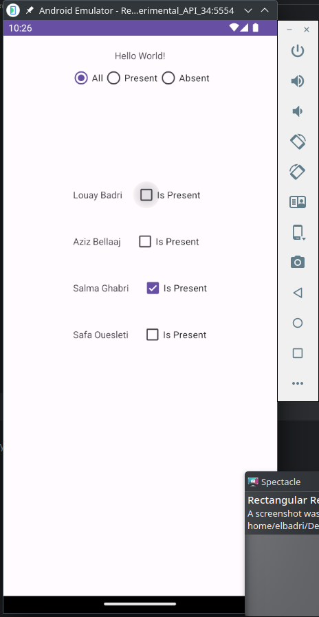
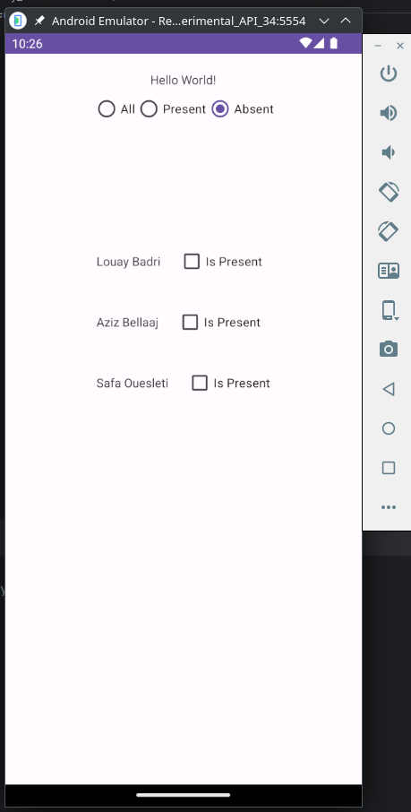

# Student Attendance App

## THIS WORK IS DONE BY Louay Badri, Aziz Bellaaj, Salma Ghabri and Safa Ouesleti

## Introduction

This Android app simplifies attendance tracking for teachers. It enables them to:

- View the attendance status (Absent or Present) of each student.
- Change the attendance status of a student.
- Filter the list of students based on their attendance status (Absent or Present).

## Features

### 1. Viewing Attendance Status

The app displays a list of students, each with a checkbox indicating their attendance status as Absent or Present.

<!-- Add an image here to visually demonstrate the feature -->

### 2. Changing Attendance Status

Teachers can change the attendance status of a student by interacting with the associated checkbox in the list.

### 3. Filtering Student List

Teachers can filter the list of students based on attendance status:

- **All:** Displays the entire list of students.
- **Present:** Displays students marked as present.
- **Absent:** Displays students marked as absent.

## Usage

To use the app:

1. Launch it on your Android device.
2. View the list of students and their attendance status.
3. Change the attendance status by interacting with the student's checkbox.
    - Note: The status change won't be instant if you are in the absent/present section.
4. Use the radio buttons to filter the list based on attendance status.
